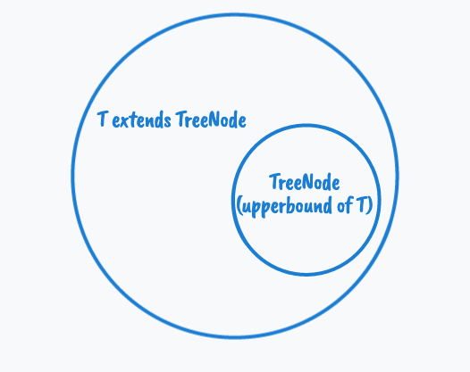

# ts-type.operator.extends

```ts
type TreeNode = {
  value: string
}

type LeafNode =  TreeNode & {
  isLeaf: true
} 

type InnerNode = TreeNode & {
  children: [TreeNode] | [TreeNode, TreeNode]
}


//Answer 1
type Node<T> = TreeNode & T

function mapNode<T>(node: Node<T>, f: (v: string) => string):T {
  return {
    ...node,
    value: f(node.value)
  }
}

function mapNode2<T extends TreeNode>(node: T, f: (v: string) => string):T {
  return {
    ...node,
    value: f(node.value)
  }
}
```

mapNode2 藉由 extends 來限制 `<T>` 的 generic 只能是 TreeNode 的 超集，這時候我們會把 TreeNode 稱作為 T 的 upperbound（上界）

  


自己試下來也可以藉由 mapNode 的寫法來做到一樣的效果就是，不過語法比較麻煩，還要另外宣告一個 type

如果要接受多個 entends 呢？在後面加個 [[ts.type-op-union-intersection]] 的 intersection 就可以（交集），

```ts
type HasSides = {numberOfSides: number};
type SideHavLength = {SideLangth: number};

function printPerimeter<T extends HasSides & SideHavLength>(s: T) {
  console.log(s.numberOfSides * s.numberOfSides);
}

const square:HasSides & SideHavLength = {
  numberOfSides: 4,
  SideLangth: 4
}

printPerimeter(square);
```

當然也可以用 union 聯集

```ts
type Mac = {
  coke: true,
  burger: true
}

type Kent = {
  coke: true,
  chicken: true
}

function Drink<T extends Mac | Kent>(store: T) {
  console.log(store.coke);
}
```

